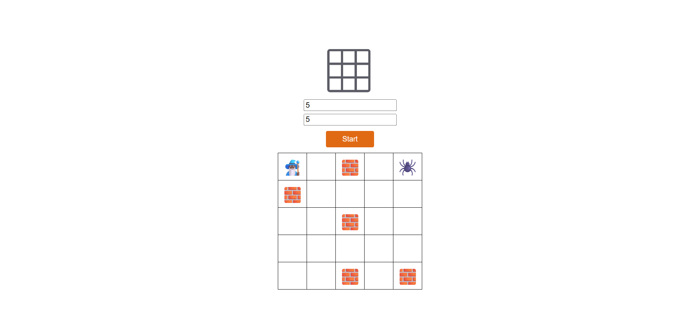

<h1 align="center" style="font-weight: bold;">Grid-Based Game 🧙🏾‍♀️ </h1>

<br>
<p align="center">
 <a href="#tech" title="technologies">Technologies</a> • 
 <a href="#about" title="about">About</a> • 
 <a href="#clone" title="clone">Clone</a> •
 <a href="https://github.com/2Sant0s/grid-based-game/blob/main/script.js">Project</a>
</p>

<h2 id="layout">🎨 Layout</h2>

<p align="center">
    
</p>

<h2 id="tech">💻 Technologies</h2>

[](https://developer.mozilla.org/en-US/docs/Web/HTML)
[](https://developer.mozilla.org/en-US/docs/Web/CSS)
[](https://developer.mozilla.org/en-US/docs/Web/JavaScript)
<br>


<!-- about -->
<h2 id="about">☁️ About</h2>
<p>This project is a grid-based game build with JavaScript for web browsers. It allows users to set the grid size and control a player character using the W, A, S, and D keys to move around.
</p>

<!-- sobre -->
<h2 id="clone">📥 Clone</h3>

To get a copy of this project, open your terminal and run:

```bash
git clone https://github.com/2Sant0s/grid-based-game.git
```

<h2 id="status">🚦 Status</h2>

<!--  -->
Experimental project, may contain bugs

